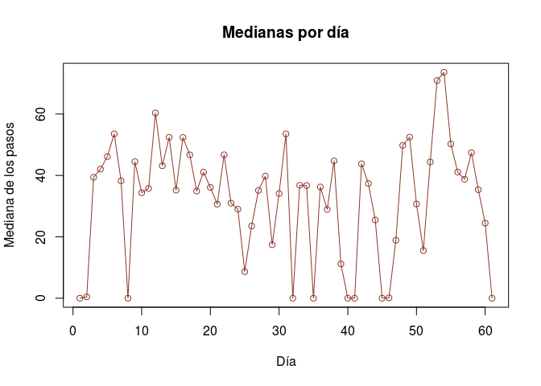
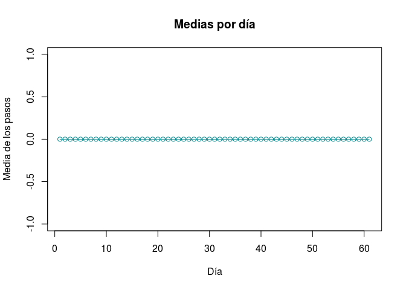
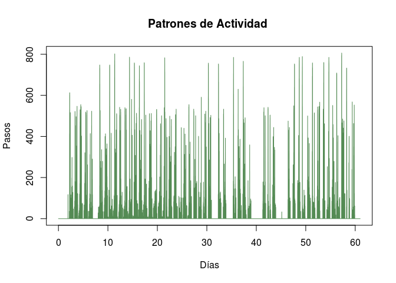
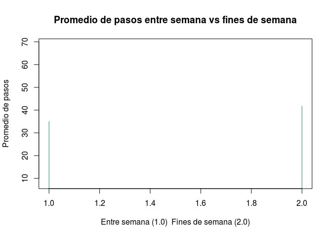

# Práctica_1
MGAZ (Marcel Gustavo Alamán Zárate)  
March 14, 2016  
# Introducción
Por medio de dispositivos como el Fibit o la Nike Fuelband, es posible monitorear la actividad diaria de una persona. Los datos abarcan los meses de Octubre y Noviembre de 2012. 

# Procesamiento de los datos 

## Carga de datos 

Se cargaran los datos usando el comando read.csv

```r
activity<- read.csv("~/Documentos/BioComp/activity.csv")
```
Basicamente la idea es poder tener sub-bases de datos, luego entonces lo más conveniente a mi parecer será separarlos de acuerdo al día en que se realizaron los pasos.
Primero es necesario saber cuantos días distintos hay en la base de datos, eso se hará buscando las fechas únicas y contandolas

```r
jour<-unique(activity$date)
length (jour)
```

```
## [1] 61
```
Son 61 días. ¡Albricias!
Ahora sería conveniente saber si los 61 días tienen el mismo número de entradas para esto: Si el número total de entradas (filas) en la base de datos es igual al número distinto de días por las veces que se repite cualquier día; entonces se puede inferir que todos los días tienen el mismo número de datos.

```r
nrow(activity)==length(jour)*sum(activity$date==jour[1])
```

```
## [1] TRUE
```

###Cortar la base de datos
Ahora de la base de datos grande seria conveniente cortarla por semanas, se sabe que el primero de octubre de 2012 es lunes, por lo tanto hasta el 8 de octubre sería una semana entonces, insertaremos una columna extra a la base de datos (se llamará "counting") que a cada entrada le asigne un número. 

```r
activity[,4]<-c(1:nrow(activity))
head(activity[,4])
```

```
## [1] 1 2 3 4 5 6
```

```r
names(activity)<-c("steps","date","interval","counting")
```

##Cambiar los valores "NA" en la base de datos

En la columna de "Steps" hay algunos valores NA para ello se sustituiran los valores de N/A por 0 para poder graficarlos. Para asegurar que el comando que se va a ocupar no vaya a borrar datos se pondrá un prueba de seguridad: La cantidad de valores NA en la columna "Steps" sumado a todos los valores debe ser igual a al numero de filas de la base de datos completa.

```r
nrow(activity)==(sum(is.na(activity$steps))+ length(which(activity$steps>=0)))
```

```
## [1] TRUE
```
Ahora se procede a cambiar todos los valores NA por 0, se revisara viendo las primeras lineas y se comprobara que ya no existan NA, es espera que al sumar aquellos valores NA el total sea 0 en la columna "Steps"

```r
activity$steps[is.na(activity$steps)]<-0
head(activity)
```

```
##   steps       date interval counting
## 1     0 2012-10-01        0        1
## 2     0 2012-10-01        5        2
## 3     0 2012-10-01       10        3
## 4     0 2012-10-01       15        4
## 5     0 2012-10-01       20        5
## 6     0 2012-10-01       25        6
```

```r
sum(is.na(activity$steps))
```

```
## [1] 0
```

#Calculando medias y medianas
¡Genial! Ahora hay que sacar la media y la mediana de cada día. Después graficar todo.

```r
j=1
medianne<-c(1:61)
moyenne<-c(1:61)
res<-matrix(nrow=61, ncol=3, names<-c("Día","Media","Mediana"))
res[,1]<-c(1:61)
for (j in 1:61){
  a=1+(288*(j-1))
  b=288+(288*(j-1))
  medianne[j]=median(activity$steps[a:b])
  moyenne[j]=mean(activity$steps[a:b])
}
res[,2]<-medianne
res[,3]<-moyenne
print("Dia Mediana Media")
```

```
## [1] "Dia Mediana Media"
```

```r
print(res)
```

```
##       [,1] [,2] [,3]               
##  [1,] "1"  "0"  "0"                
##  [2,] "2"  "0"  "0.4375"           
##  [3,] "3"  "0"  "39.4166666666667" 
##  [4,] "4"  "0"  "42.0694444444444" 
##  [5,] "5"  "0"  "46.1597222222222" 
##  [6,] "6"  "0"  "53.5416666666667" 
##  [7,] "7"  "0"  "38.2465277777778" 
##  [8,] "8"  "0"  "0"                
##  [9,] "9"  "0"  "44.4826388888889" 
## [10,] "10" "0"  "34.375"           
## [11,] "11" "0"  "35.7777777777778" 
## [12,] "12" "0"  "60.3541666666667" 
## [13,] "13" "0"  "43.1458333333333" 
## [14,] "14" "0"  "52.4236111111111" 
## [15,] "15" "0"  "35.2048611111111" 
## [16,] "16" "0"  "52.375"           
## [17,] "17" "0"  "46.7083333333333" 
## [18,] "18" "0"  "34.9166666666667" 
## [19,] "19" "0"  "41.0729166666667" 
## [20,] "20" "0"  "36.09375"         
## [21,] "21" "0"  "30.6284722222222" 
## [22,] "22" "0"  "46.7361111111111" 
## [23,] "23" "0"  "30.9652777777778" 
## [24,] "24" "0"  "29.0104166666667" 
## [25,] "25" "0"  "8.65277777777778" 
## [26,] "26" "0"  "23.5347222222222" 
## [27,] "27" "0"  "35.1354166666667" 
## [28,] "28" "0"  "39.7847222222222" 
## [29,] "29" "0"  "17.4236111111111" 
## [30,] "30" "0"  "34.09375"         
## [31,] "31" "0"  "53.5208333333333" 
## [32,] "32" "0"  "0"                
## [33,] "33" "0"  "36.8055555555556" 
## [34,] "34" "0"  "36.7048611111111" 
## [35,] "35" "0"  "0"                
## [36,] "36" "0"  "36.2465277777778" 
## [37,] "37" "0"  "28.9375"          
## [38,] "38" "0"  "44.7326388888889" 
## [39,] "39" "0"  "11.1770833333333" 
## [40,] "40" "0"  "0"                
## [41,] "41" "0"  "0"                
## [42,] "42" "0"  "43.7777777777778" 
## [43,] "43" "0"  "37.3784722222222" 
## [44,] "44" "0"  "25.4722222222222" 
## [45,] "45" "0"  "0"                
## [46,] "46" "0"  "0.142361111111111"
## [47,] "47" "0"  "18.8923611111111" 
## [48,] "48" "0"  "49.7881944444444" 
## [49,] "49" "0"  "52.4652777777778" 
## [50,] "50" "0"  "30.6979166666667" 
## [51,] "51" "0"  "15.5277777777778" 
## [52,] "52" "0"  "44.3993055555556" 
## [53,] "53" "0"  "70.9270833333333" 
## [54,] "54" "0"  "73.5902777777778" 
## [55,] "55" "0"  "50.2708333333333" 
## [56,] "56" "0"  "41.0902777777778" 
## [57,] "57" "0"  "38.7569444444444" 
## [58,] "58" "0"  "47.3819444444444" 
## [59,] "59" "0"  "35.3576388888889" 
## [60,] "60" "0"  "24.46875"         
## [61,] "61" "0"  "0"
```

```r
plot(res[,1],res[,3],"o",main="Medianas por día",xlab="Día",ylab="Mediana de los pasos",col="tomato4")
```



```r
plot(res[,1],res[,2],"o",main="Medias por día",xlab="Día",ylab="Media de los pasos",col="turquoise4")
```



##Patrones de actividad
Los patrones de actividad se expresarán en una gráfica usando los valores de media y mediana.

```r
plot(activity[,4]/288,activity[,1],"s",main="Patrones de Actividad ",xlab="Días",ylab="Pasos",col="palegreen4")
```



##Pasos entre semana y fin de semana
De forma general: Se trabajará con los datos de medias, para hacer la comparación.  
Se definirán las variables a ocupar

```r
med1<-c(median(moyenne[1:5]),0)
c=1
d=5
```
"med1" funcionará como pivote para tener una media general de los días entre semana, "c" y "d" son los marcadores de posición. Se usará un ciclo for para poder sacar las medias desde la matriz "moyenne". El ciclo *for* calculará la media de los datos, la media general se guardará en en la primera posición del vector "med1", mientras que la media de un nuevo lote de datos se guardará en la segunda posición del vector "med1". Para el valor inicial en la primera posición del vector "med1" se ocupará la media del primer lote de datos eso es los primeros 5 días. Al terminar el ciclo se vuelve calcular la media entre lote de datos y la media general.  

```r
for (i in 1:9){
  c=1+7*(i-1)
  d=5+7*(i-1)
  med1[1]=median(med1[1:2])
  med1[2]=median(median(moyenne[c:d]))
}
med1[1]=median(med1[1:2])
```
Para los datos en fin de semana se sigue la misma estrategia descrita anteriormente solo que ahora el vector ha de llamarse "med2"

```r
med2<-c(median(moyenne[6:7]),0)
c=6
d=7
med2<-c(0,0)
for (i in 1:8){
  c=6+7*(i-1)
  d=7+7*(i-1)
  med2[1]=median(med2[1:2])
  print(med2)
  med2[2]=median(median(moyenne[c:d]))
}
```

```
## [1] 0 0
## [1] 22.94705 45.89410
## [1] 35.36589 47.78472
## [1] 34.36350 33.36111
## [1] 35.91178 37.46007
## [1] 27.13211 18.35243
## [1] 24.51050 21.88889
## [1] 37.81862 51.12674
```

```r
med2[1]=median(med2[1:2])
```
Finalmente se gráfica con el fin de distinguir de forma visual que tan distintos son los valores.

```r
ix=c(1:2)
ygrec=c(med1[1],med2[1])
plot(main="Promedio de pasos entre semana vs fines de semana",ix,ygrec,"h", col="darkcyan",xlab="Entre semana (1.0)  Fines de semana (2.0)",ylab="Promedio de pasos", asp=0.009)
```



#Conclusiones
* En terminos generales se puede observar que la estrategia propuesta de sustituir los valores "NA" por "0" no fue la mejor, puesto que todas las medianas se vuelven practicamente cero, debido a que hay puntos en los días en que no se recabaron datos. 
* Consideré más descriptivo el comportamiento de la media porque si se puede observar un cambio de comportamiento más claro en comparación a la mediana; yo supongo que la razón de esto es que la media se ve más afectada por valores extremos y eso hace que se compense un poco.
* Aparentemente el usuario del dispositivo del cual provienen los datos camina casi el doble durante los fines de semana que entre semana.
* Como ejercicio, esta practica me ha servido para entender un poco la metodología. Sin embargo encuentro de pronto que alguien externo pueda entender mi explicación debido a mi sintaxis.
